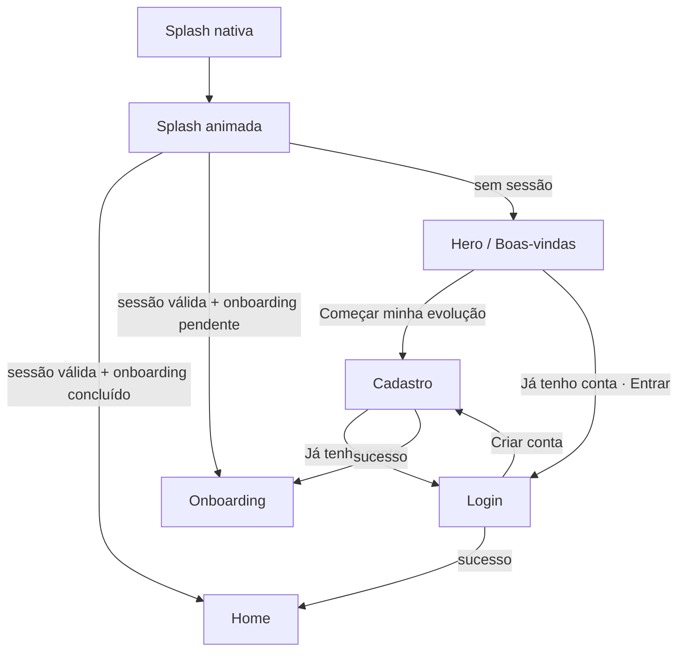

# 22 de setembro: fluxo inicial (Splash → Hero → Login → Cadastro)

Plano de evolução do primeiro contato com o app: **carregar bonito**, **despertar desejo** e **entrar sem atrito**. Tudo isso já com a **paleta renovada** (mais viva e mais leve, sem perder a pegada dark) e um **sistema de temas** para a pessoa escolher como quer ver o app.

O Gyn Flow deixa de ser só "app de treino" e passa a ser um **app evolutivo de bem-estar**: treino, corpo, sono, hidratação, alimentação e mente, com a evolução sempre visível.

Cada etapa tem status, entregas, critérios de aceite e um **prompt pronto** para executar com IA.

---

## Legenda de status

| Ícone | Significado |
| --- | --- |
| ⬜ | A fazer |
| 🟨 | Parcial: já existe, mas precisa evoluir |
| ✅ | Concluído |
| ⏸️ | Aguardando decisão |

## Painel de status

| # | Etapa | Status | Depende de |
| --- | --- | --- | --- |
| 0 | Decisões de base (marca, CTA, fonte, tema padrão) | ✅ | (nenhuma) |
| 1 | Paleta, tokens e sistema de temas | ✅ | 0 |
| 2 | Preferências e sessão persistidas | ✅ | 1 |
| 3 | Tipografia e carregamento de fontes | ✅ | 0 |
| 4 | Marca em SVG (`BrandMark`) + splash nativa | ✅ | 1 |
| 5 | Splash animada com carregamento real | ✅ | 2, 3, 4 |
| 6 | Componentes visuais do hero (aurora, anel, chips) | ✅ | 1 |
| 7 | Tela Hero (`welcome`) | ✅ | 5, 6 |
| 8 | Roteamento e transições | ✅ | 7 |
| 9 | Login renovado | ✅ | 1, 8 |
| 10 | Cadastro renovado | ✅ | 1, 8 |
| 11 | Seletor de tema | ✅ | 1, 2 |
| 12 | Migração das demais telas para tokens | ✅ | 1 |
| 13 | QA: acessibilidade, movimento e performance | 🟨 | todas |

> Execução em 22/09: etapas 0 a 12 concluídas. A etapa 13 foi validada no web e falta testar em aparelho (ver **Registro de execução** no fim do documento).

> Por que os tokens vêm antes da splash: splash, hero e auth vão nascer já no tema novo. Se fizermos as telas primeiro, teremos que refazê-las na migração.

---

## Onde estamos (diagnóstico de 22/09)

- **Splash** (`app/(auth)/splash.tsx`): estática, `setTimeout` de 1,2 s, vai direto para o login e não carrega nada de verdade.
- **Hero / boas-vindas**: não existe.
- **Login e cadastro**: prontos (React Hook Form + Zod + mock em `src/services/auth.ts`), mas exibem **"Ignite Gym"** (`BrandHeader`, splash), enquanto o ícone antigo trazia outro nome. O nome definitivo é **Gyn Flow** (com n).
- **Navegação**: o botão "Voltar para o login" do cadastro usa `<Link>` (push), então a pilha cresce: login → cadastro → login → cadastro…
- **Cores**: `src/constants/colors.ts` é um objeto estático importado em **17 arquivos**, dentro de `StyleSheet.create`. Assim ele não consegue trocar de tema em tempo de execução, e os temas exigem migrar para um hook.
- **Cores fixas espalhadas**: `home.tsx` (9), `dashboard.tsx` (4), `start.tsx` (3), `OnboardingIllustration.tsx` (vários). São tons saturados e escuros (`#0E7490`, `#7C3AED`, `#B91C1C`…), e grande parte da sensação "densa" vem deles.
- **Contraste**: o botão primário (branco sobre `#00875F`) tem **4,53:1**, passando no limite. O texto `placeholder` `#7C7C8A` sobre `surface` tem **3,95:1** e **reprova** no WCAG AA.
- **Splash nativa**: `assets/images/splash/splash-icon.png` tem texto embutido com serrilhado, e o halter é diferente do `icon.png`.
- **Libs**: `react-native-svg`, `react-native-reanimated`, `expo-haptics`, `expo-font` e `expo-splash-screen` **já estão instaladas**. Não há lib de gradiente, blur, storage nem Google Fonts.
- **Plano anterior**: `animacoes-splash-transicoes.md` pedia uma splash de **10 s**. Este plano **substitui** isso por uma splash guiada por carregamento real (mínimo de ~1,8 s e máximo de ~4 s), porque 10 s de espera derrubam a primeira impressão.

---

## Fluxo



### Regras de navegação

| De → Para | Método | Animação | Por quê |
| --- | --- | --- | --- |
| Splash nativa → splash animada | mesmo quadro visual | nenhuma | Sem "pulo": mesma cor de fundo, mesmo halter, mesma posição |
| Splash → hero / home / onboarding | `router.replace` | `fade` 400 ms | O "voltar" nunca retorna para a splash |
| Hero → login / cadastro | `router.push` | `slide_from_right` 280 ms | O "voltar" retorna ao hero |
| Login ↔ cadastro | `router.replace` | `slide_from_right` | A pilha fica sempre `[hero, login ou cadastro]` e não cresce |
| Login / cadastro → home / onboarding | `router.replace` | `fade` | Limpa o auth da pilha |
| "Voltar" no hero (Android) | padrão | (nenhuma) | Fecha o app |

---

## Pesquisa: o que os melhores apps da área fazem

| Referência | O que faz bem | Como aplicamos no Gyn Flow |
| --- | --- | --- |
| **WHOOP** | O fundo escuro é **funcional**: os dados "saltam" e a tela é confortável às 5h30 da manhã. O vocabulário de cor é **estreito**, e cada cor tem **um significado**. A métrica principal é enorme (~72 pt). | Anel de evolução com número grande no hero. **Cores de domínio fixas** (sono é sempre violeta, água é sempre ciano…). |
| **Apple Fitness (anéis)** | Os três anéis sobre preto viraram o símbolo de "progresso do dia". | Um **anel triplo próprio** (Treino, Sono, Hidratação) no hero: mesma força simbólica, identidade nossa. |
| **Gentler Streak** (Apple Design Award 2024) | Tom gentil e **sem culpa**, progresso pessoal sem comparação, dados **interpretados** e não só números. | Texto acolhedor ("no seu ritmo"). No hero, métricas inclusivas (força, sono, sequência) e **não só perda de peso**. |
| **Fitbod** | Pergunta o mínimo antes de mostrar valor e deixa os detalhes para depois. | O hero não pede nada. O cadastro fica só com o essencial, e o onboarding (que já existe) vem depois. |
| **Strava / Nike Training Club** (padrão de mercado) | Tela de boas-vindas com visual forte, CTA primário de "começar" e link secundário de "entrar". | Dois CTAs fixos no rodapé do hero. |
| **Tendências de 2026** | Gradiente **como iluminação, não decoração** (esfumado, ambiente), vidro **tingido** em vez de branco, dark mode como "mood mode" com tokens. | **Aurora** de fundo, cartões de vidro tingido, temas. |
| **Boas práticas de hero** | A pessoa entende o produto em segundos, há poucos elementos, o CTA se explica sozinho e a tela carrega rápido. | Hero feito em **SVG** (sem imagem pesada): 1 título, 1 subtítulo e 2 CTAs. |

---

## Direção do Hero

**Promessa central:** *Veja seu corpo evoluir, dia após dia.*

A tela mostra o produto **funcionando**: um anel de evolução se desenhando, com um número subindo e pequenos cartões de conquistas flutuando sobre uma luz aurora. A pessoa não lê sobre evolução, ela **vê** a evolução.

> **Hero v2 (22/09):** a partir do mockup `image/image.png`, o hero ganhou a foto de duas pessoas treinando, painéis de vidro com benefícios, a palavra "EVOLUA" vazada ao fundo, um lema no topo e um rodapé. O wireframe abaixo é a v1; os detalhes da v2 estão em **Hero v2** no Registro de execução.

### Wireframe

```txt
┌────────────────────────────────────┐
│  ▬▬▬ Gyn Flow                      │  marca compacta
│                                    │
│   ░░░ aurora verde→ciano→violeta ░░░│  luz ambiente, se move devagar
│                   ┌──────────────┐ │
│      ╭──────╮     │ 🔥 12 dias   │ │  chips de vidro tingido
│    ╭─┤ ╭──╮ ├─╮   └──────────────┘ │  (flutuam ±4 px)
│    │ │ │78│ │ │   ┌──────────────┐ │
│    ╰─┤ ╰──╯ ├─╯   │ ↑ +18% força │ │  anel triplo se desenhando
│      ╰──────╯     └──────────────┘ │  Treino · Sono · Hidratação
│     evolução hoje ┌──────────────┐ │
│                   │ ☾ 7h40 sono  │ │
│                   └──────────────┘ │
│                                    │
│  TREINO · SONO · ÁGUA · MENTE      │  eyebrow (acento, espaçado)
│  Veja seu corpo                    │
│  evoluir, dia após dia.            │  título 34–36 pt, "evoluir" em gradiente
│  Treinos, hábitos e bem-estar em   │
│  um só lugar, com uma pontuação    │  subtítulo 16 pt, text.secondary
│  diária que mostra seu avanço.     │
│                                    │
│  ┌──────────────────────────────┐  │
│  │   Começar minha evolução  →  │  │  CTA primário (fixo no rodapé)
│  └──────────────────────────────┘  │
│       Já tenho conta · Entrar      │  CTA secundário
│         Grátis para começar        │  linha de confiança (muted)
└────────────────────────────────────┘
```

### Opções de título (escolher uma)

1. **Veja seu corpo evoluir, dia após dia.** (recomendado)
2. Cuide de você. A gente mostra o quanto você avançou.
3. Sua evolução, visível todos os dias.

### Coreografia de entrada (continua a splash, total < 1,5 s)

| Tempo | Elemento | Animação |
| --- | --- | --- |
| 0–400 ms | Aurora | opacidade 0 → 1, escala 0,9 → 1 |
| 150–700 ms | Eyebrow + título | fade + sobe 12 px (cascata de 80 ms) |
| 300–1500 ms | Anel triplo | arcos se desenham (80 ms entre um e outro), número conta de 0 a 78 |
| 900–1400 ms | Chips | surgem com spring (escala 0,8 → 1), depois flutuam em loop |
| 1000–1300 ms | CTAs | sobem 24 px + fade |
| em loop | Aurora | deriva lenta (16 s), quase imperceptível |

### Regras do hero

- **Não inventar prova social** ("+10 mil usuários"). Até existirem números reais, a linha de confiança é "Grátis para começar".
- Os valores do anel e dos chips são **ilustrativos**. Para leitores de tela, o conjunto é marcado como decorativo ("Exemplo do painel de evolução").
- Métricas **inclusivas**: força, sono e sequência. Nada de "−5 kg" como promessa.
- Com **Reduzir movimento** ativado (`useReducedMotion`), tudo aparece já no estado final, só com fade.
- **Sem imagem bitmap pesada**: tudo em SVG + Reanimated. Na v2, a única imagem é o recorte das pessoas em WebP (~100 KB), pré-carregado na splash.
- **Haptics** leve (`expo-haptics`) ao tocar nos CTAs.
- **Telas baixas** (altura ≤ 700): anel menor e só 2 chips.
- **Fase 2 (opcional)**: carrossel de 3 cenas (Evolução, Corpo, Bem-estar) com paginação por pontos e CTAs sempre fixos.

---

## Paleta de cores e temas

### Diagnóstico → direção

Hoje: base `#121214` quase preta, superfícies cinza neutro e um único verde médio. Resultado: **escuro, denso e pesado**.

Direção:

1. **Subir a base um degrau e tingir** de azul-ardósia. Continua escuro, mas respira (luminância da base sobe ~70%).
2. **Acento mais vivo e luminoso** (menta vibrante), com **texto escuro sobre o acento**.
3. **Cor com significado**: domínios fixos (treino, sono, água…), como no WHOOP.
4. **Gradiente como luz** (aurora), só em splash, hero, fundo do auth e momentos de celebração.
5. **Separação por borda sutil + elevação**, e não por preto profundo.

### Camadas de token

```txt
primitivas (escalas cruas: mint-400, slate-900, violet-300…)
      ↓
semânticas (bg.base, text.secondary, accent.primary, domain.sono…)
      ↓
tema (Flow, Meia-noite, Aurora, Brasa → cada um preenche as semânticas)
```

As telas **só** usam tokens semânticos, nunca hex direto.

### Temas

| Token | **Flow** (padrão) | **Meia-noite** | **Aurora** | **Brasa** |
| --- | --- | --- | --- | --- |
| `bg.base` | `#151A23` | `#0E0F12` | `#16152B` | `#1B1717` |
| `bg.surface` | `#1E2531` | `#18191E` | `#201E3A` | `#262020` |
| `bg.raised` | `#283040` | `#212329` | `#2B2849` | `#312A29` |
| `bg.high` | `#323B4D` | `#2B2D35` | `#36325A` | `#3C3332` |
| `text.primary` | `#F4F7FB` | `#FFFFFF` | `#F5F3FF` | `#FFF7F3` |
| `text.secondary` | `#B9C1D0` | `#C4C6CE` | `#C3BFE0` | `#D6C6BF` |
| `text.muted` | `#8E97AA` | `#8A8C98` | `#9A95BD` | `#A8978F` |
| `accent.primary` | `#34E3A4` | `#1FD99A` | `#A597FF` | `#FF8A5B` |
| `accent.pressed` | `#22C98C` | `#12B981` | `#8E7DF5` | `#F2703F` |
| `accent.onPrimary` | `#05231A` | `#04200F` | `#15103A` | `#2B0F04` |
| `accent.secondary` | `#4FD6F2` | `#4FD6F2` | `#4FD6F2` | `#FFC65C` |
| `gradient.aurora` | `#34E3A4 → #4FD6F2 → #9D8CFF` | `#1FD99A → #0F8C6A` | `#A597FF → #F58BD8 → #4FD6F2` | `#FF8A5B → #FFC65C → #FF7A85` |

Tokens derivados (iguais em todos os temas escuros):

- `accent.soft` = `accent.primary` a 14% (fundo de chip selecionado, opção ativa)
- `border.subtle` = `rgba(255,255,255,0.07)` · `border.strong` = `rgba(255,255,255,0.14)` · `border.focus` = `accent.primary`
- `bg.overlay` = `bg.base` a 72% (vidro tingido, modais)

Personalidade de cada tema:

- **Flow** (padrão): a evolução da identidade atual, com o mesmo verde e mais luz. Escuro e respirável.
- **Meia-noite**: para quem gosta do visual atual, mais denso. Ótimo em telas OLED e à noite. A aurora vira monocromática verde.
- **Aurora**: violeta + ciano, ligado à referência `preview/novas/treino.png`. Mais "tech" e calmo.
- **Brasa**: coral quente, para energia e treinos intensos.
- **Dia** (fase futura, opcional): claro, só se houver demanda. Valores iniciais: base `#F5F7FB`, surface `#FFFFFF`, texto `#141A24` / `#4B5567` / `#687387`, primário **`#0A7C56`** (o verde precisa escurecer no claro: branco sobre ele dá 5,21:1).

### Cores de domínio (fixas em todos os temas)

Cada cor tem **um único significado** no app inteiro. Isso vale para cards, gráficos, ícones e anéis.

| Domínio | Cor | Onde aparece |
| --- | --- | --- |
| Treino | `#34E3A4` | Treinos, força, exercícios |
| Sono | `#9D8CFF` | Sono, descanso, recuperação |
| Hidratação | `#4FD6F2` | Água |
| Alimentação | `#FFA65C` | Refeições, nutrição |
| Mente / humor | `#F58BD8` | Humor, estresse, frase do dia |
| Conquistas / sequência | `#FFD35C` | Streaks, medalhas, metas batidas |

### Cores de status

| Status | Cor |
| --- | --- |
| `status.success` | `#34E3A4` |
| `status.warning` | `#FFC23D` |
| `status.danger` | `#FF6B7A` |
| `status.info` | `#6CB8FF` |

Regra: **status** aparece só em feedback (formulário, alerta, toast). **Domínio** aparece só em dados. Um não substitui o outro.

### Contraste (validado com WCAG, 22/09)

| Combinação | Atual | Flow | Meia-noite | Aurora | Brasa |
| --- | --- | --- | --- | --- | --- |
| Texto principal / base | 18,7 | 16,2 | 19,2 | 16,3 | 16,8 |
| Texto secundário / base | 10,8 | 9,6 | 11,2 | 10,1 | 10,7 |
| Texto muted / surface | **3,95 ✗** | 5,25 | 5,25 | 5,66 | 5,72 |
| Acento / base | 6,9 | 10,5 | 10,5 | 7,2 | 7,7 |
| Texto do botão / botão | 4,53 | 10,0 | 9,4 | 7,3 | 7,7 |

- Todas as cores de domínio e de status ficam **≥ 5,5:1** sobre `bg.base` e `bg.surface` do Flow.
- ⚠️ **Branco sobre acento vivo reprova** (1,66:1 no Flow). O texto sobre `accent.primary` **sempre** usa `accent.onPrimary`.

### Regras de uso

- **60 / 30 / 10**: 60% fundo, 30% superfícies, 10% acento.
- **Um acento por tela** para a ação principal.
- Nunca `#000000` puro de fundo (exceto um eventual modo OLED futuro).
- **Vidro tingido** = `bg.surface` a ~72% + `border.subtle`. **Sem blur no Android** (custo alto). Se quiser blur no iOS, avaliar `expo-blur` depois.
- **Glow** do CTA: gradiente radial do acento atrás do botão (funciona igual em iOS, Android e web) em vez de sombra colorida.
- A **aurora** fica restrita a splash, hero, fundo do auth (intensidade baixa) e celebrações.

### Arquitetura no código

```txt
src/theme/
  palette.ts        # primitivas
  themes.ts         # flow, meiaNoite, aurora, brasa (dia no futuro)
  types.ts          # ThemeTokens, ThemeName
  typography.ts     # escala tipográfica (etapa 3)
  ThemeProvider.tsx # contexto + tema salvo + isReady
  useTheme.ts
  makeStyles.ts     # makeStyles((t) => ({...})) → hook de estilos memoizado
  index.ts
```

Uso numa tela:

```tsx
const useStyles = makeStyles((t) => ({
  container: { backgroundColor: t.bg.base },
  title: { color: t.text.primary },
}));

export default function LoginScreen() {
  const styles = useStyles();
  // ...
}
```

Migração sem quebrar nada: `src/constants/colors.ts` vira uma **camada de compatibilidade** que reexporta o tema Flow com as chaves antigas (`background`, `surface`, `primary`…). As 17 telas continuam funcionando e migram uma a uma. `primaryDark` mantém `#00875F` na compatibilidade, porque `home.tsx` e `start.tsx` usam essa cor como fundo com texto branco até a etapa 12.

---

## Etapas sequenciais

### Etapa 0: Decisões de base

**Status:** ✅ Decidido em 22/09 · **Depende de:** nada

| # | Decisão | Recomendação | Alternativa |
| --- | --- | --- | --- |
| D1 | Nome da marca | ✅ **Gyn Flow** (com n; decidido em 22/09) | Manter "Ignite Gym" |
| D2 | Tagline | ✅ **"Treino · Saúde · Bem-estar"** (combina com a visão ampliada) | "Treine sua mente e o seu corpo" (atual) |
| D3 | CTA principal do hero | ✅ **"Começar minha evolução" → cadastro** + "Já tenho conta · Entrar" → login | Só "Entrar" → login (o login leva ao cadastro) |
| D4 | Fonte | ✅ **Plus Jakarta Sans** (moderna, amigável, boa com acentos) | Sora, Manrope |
| D5 | Tema padrão | ✅ **Flow** | Meia-noite |
| D6 | Hero | ✅ **Slide único bem polido agora**, carrossel na fase 2 | Carrossel de 3 cenas já na primeira versão |

> O fluxo pedido (hero → login → cadastro) funciona nas duas opções da D3. A recomendação só adiciona o atalho direto para quem ainda não tem conta, que é a maioria no primeiro acesso.

Não há prompt: esta etapa é só de decisão. Registre as escolhas aqui e mude o status para ✅.

---

### Etapa 1: Paleta, tokens e sistema de temas

**Status:** ✅ Concluído (22/09) · **Depende de:** 0

**Entregas**

- `src/theme/` com `palette.ts`, `themes.ts` (flow, meiaNoite, aurora, brasa), `types.ts`, `ThemeProvider.tsx`, `useTheme.ts`, `makeStyles.ts` e `index.ts`.
- Tokens exatamente como na seção **Paleta de cores e temas** (semânticos, domínio, status, gradiente).
- `ThemeProvider` envolvendo o app em `app/_layout.tsx`. O `contentStyle` do Stack e o `StatusBar` passam a ler o tema.
- `src/constants/colors.ts` vira camada de compatibilidade (Flow nas chaves antigas; `primaryDark` legado `#00875F`).
- `Button` e `Input` migrados para `makeStyles`: botão primário com `accent.primary` + texto `accent.onPrimary`; foco do input com `border.focus`; placeholder com `text.muted`.
- `WebInputStyleReset` lendo o tema.

**Critérios de aceite**

- Trocar o tema padrão no código (ex.: `aurora`) muda `Button` e `Input` sem erro.
- Telas não migradas continuam funcionando.
- `npm run typecheck` e `npm run lint` passam.

**Prompt**

```txt
Leia 22-setembro-fluxo-inicial.md (seções "Paleta de cores e temas" e "Etapa 1").
Crie o sistema de temas em src/theme/ (palette, themes, types, ThemeProvider,
useTheme, makeStyles, index) com os temas flow, meiaNoite, aurora e brasa usando
exatamente os hex da tabela, incluindo tokens de domínio, status, gradient.aurora,
accent.soft, border.* e bg.overlay.
makeStyles deve receber (theme) => estilos e devolver um hook memoizado por tema.
Envolva o app com ThemeProvider em app/_layout.tsx (Stack contentStyle e StatusBar
lendo o tema). Transforme src/constants/colors.ts em compatibilidade que reexporta o
tema flow nas chaves antigas, mantendo primaryDark = '#00875F'.
Migre Button, Input e WebInputStyleReset para makeStyles; o texto do botão primário
usa accent.onPrimary (nunca branco sobre o acento).
Não mexa em outras telas. Rode npm run typecheck e npm run lint.
```

---

### Etapa 2: Preferências e sessão persistidas

**Status:** ✅ Concluído (22/09) · **Depende de:** 1

**Entregas**

- `npx expo install @react-native-async-storage/async-storage expo-secure-store`
- `src/services/storage.ts`: wrapper com try/catch (preferências via AsyncStorage).
- Token de sessão no `expo-secure-store`, com **fallback para AsyncStorage no web** (o SecureStore não funciona no web).
- `auth.ts`: `signIn`/`signUp` salvam a sessão, `signOut` limpa e a nova função `getSession(): Promise<AuthUser | null>` lê a sessão.
- `ThemeProvider` hidrata o tema salvo e expõe `isReady` e `setTheme(name)`.

**Critérios de aceite**

- Fechar e reabrir o app mantém o tema escolhido.
- Com sessão salva, o app vai direto para a home (validado na etapa 5).
- Se o storage falhar, o app sobe com o tema Flow e sem sessão, sem travar.

**Prompt**

```txt
Leia 22-setembro-fluxo-inicial.md (Etapa 2).
Instale com npx expo install @react-native-async-storage/async-storage expo-secure-store.
Crie src/services/storage.ts (get/set/remove com try/catch). Guarde o token com
expo-secure-store e use AsyncStorage como fallback quando Platform.OS === 'web'.
Em src/services/auth.ts: signIn e signUp persistem { token, user }, signOut limpa,
e adicione getSession() que retorna AuthUser | null. Mantenha os mocks atuais.
No ThemeProvider: carregue o tema salvo na montagem, exponha isReady e setTheme(name)
que persiste a escolha. Falhas de storage caem no tema flow sem quebrar.
Rode npm run typecheck e npm run lint.
```

---

### Etapa 3: Tipografia e carregamento de fontes

**Status:** ✅ Concluído (22/09) · **Depende de:** 0 (D4)

**Entregas**

- `npx expo install @expo-google-fonts/plus-jakarta-sans` (ou a fonte escolhida na D4).
- `src/theme/typography.ts` com a escala:

| Token | Tamanho / altura da linha | Peso | Uso |
| --- | --- | --- | --- |
| `display` | 36 / 42 | 800 | Título do hero |
| `h1` | 28 / 34 | 800 | Títulos de tela |
| `h2` | 22 / 28 | 700 | Seções |
| `body` | 16 / 24 | 400 | Texto corrido |
| `bodyStrong` | 16 / 24 | 600 | Botões, destaques |
| `caption` | 13 / 18 | 600 | Chips, legendas |
| `overline` | 12 / 16 | 700, `letterSpacing` 1.6, maiúsculas | Eyebrow do hero |
| `metric` | 44 / 48 | 800, `fontVariant: ['tabular-nums']` | Número do anel |

- `useFonts` no root layout. O resultado alimenta a splash (etapa 5), sem tela branca.

**Critérios de aceite**

- A fonte aparece em iOS, Android e web.
- Se a fonte falhar, o app usa a fonte do sistema e segue.

**Prompt**

```txt
Leia 22-setembro-fluxo-inicial.md (Etapa 3).
Instale @expo-google-fonts/plus-jakarta-sans com npx expo install. Carregue os pesos
400, 600, 700 e 800 com useFonts no app/_layout.tsx e exponha fontsLoaded para a splash
(não renderize tela branca enquanto carrega; a splash nativa continua visível).
Crie src/theme/typography.ts com os tokens display, h1, h2, body, bodyStrong,
caption, overline e metric exatamente como na tabela, e exporte pelo src/theme/index.ts.
Aplique a tipografia em Button e Input. Rode typecheck e lint.
```

---

### Etapa 4: Marca em SVG (`BrandMark`) + splash nativa

**Status:** ✅ Concluído (22/09) · **Depende de:** 1, 0 (D1, D2)

**Entregas**

- `src/components/brand/BrandMark.tsx`: o halter do `icon.png` redesenhado em `react-native-svg` (barra + 2 pares de anilhas), com props `size` e `color` e as partes animáveis separadas (barra, anilhas internas, anilhas externas).
- `src/components/brand/BrandWordmark.tsx`: "Gyn Flow" + tagline (D2).
- "Ignite Gym" substituído em `BrandHeader` e na splash.
- Novo `assets/images/splash/splash-icon.png`: **só o halter, sem texto** (texto na splash nativa sai pequeno e serrilhado). Exportar em 1024×1024 com fundo transparente.
- `app.json`: `backgroundColor` da splash e do `adaptiveIcon` → `#151A23` (base do Flow).

**Critérios de aceite**

- O halter da splash nativa e o do `BrandMark` são idênticos em forma e proporção.
- Nenhum "Ignite Gym" sobra no código (`grep -ri ignite app src`).

**Prompt**

```txt
Leia 22-setembro-fluxo-inicial.md (Etapa 4) e veja assets/images/icon.png.
Crie src/components/brand/BrandMark.tsx em react-native-svg reproduzindo o halter do
ícone (barra arredondada + 2 anilhas de cada lado), com props size e color, e com
barra, anilhas internas e anilhas externas como elementos separados que aceitam
props animadas do Reanimated (Animated.createAnimatedComponent).
Crie BrandWordmark ("Gyn Flow" + tagline "Treino, saúde e bem-estar", usando a tipografia).
Troque "Ignite Gym" por Gyn Flow em BrandHeader e splash.
No app.json, mude o backgroundColor da splash e do adaptiveIcon para #151A23.
Gere um splash-icon.png só com o halter (sem texto) a partir do mesmo desenho, se
possível via script com o SVG; se não for possível, deixe o SVG pronto em
assets/images/splash/splash-mark.svg e me avise para exportar.
Rode typecheck e lint.
```

---

### Etapa 5: Splash animada com carregamento real

**Status:** ✅ Concluído (22/09) · **Depende de:** 2, 3, 4

**Entregas**

- `SplashScreen.preventAutoHideAsync()` no root. `hideAsync()` quando a splash animada fizer o primeiro `onLayout` (troca invisível).
- Tarefas reais em paralelo: **fontes**, **tema salvo** e **sessão** (`getSession`). Duração **mínima de 1,8 s** e **timeout de 4 s** (se algo travar, segue com os padrões).
- Linha de progresso fina ligada às tarefas reais (0 → 33 → 66 → 100%, com transição suave).
- Timeline:

| Tempo | O que acontece |
| --- | --- |
| 0–300 ms | Mesmo quadro da splash nativa: halter centralizado sobre `bg.base` |
| 300–900 ms | As anilhas "encaixam" na barra (spring) e a barra acende no acento |
| 700–1300 ms | A aurora floresce atrás (escala 0,6 → 1, opacidade 0 → 0,5) |
| 900–1400 ms | O wordmark "Gyn Flow" sobe com fade; a tagline aparece logo depois |
| 1200 ms → pronto | A linha de progresso completa conforme as tarefas terminam |
| saída (350 ms) | O halter reduz e sobe, tudo faz fade e acontece o `router.replace` para o destino |

- Destino: com sessão e onboarding concluído → `/(app)/home`; com sessão e onboarding pendente → `/(onboarding)/start`; sem sessão → `/(auth)/welcome`.
- Com `useReducedMotion`: halter estático + fade.
- Atualizar `animacoes-splash-transicoes.md` indicando que a meta de 10 s foi substituída por este plano.

**Critérios de aceite**

- Não aparece tela branca nem "pulo" entre a splash nativa e a animada.
- No primeiro acesso, a splash dura entre 1,8 s e 4 s; com tudo em cache, ~1,8 s.
- O "voltar" no destino nunca reabre a splash.

**Prompt**

```txt
Leia 22-setembro-fluxo-inicial.md (Etapa 5 e "Regras de navegação").
Refaça app/(auth)/splash.tsx:
- chame SplashScreen.preventAutoHideAsync() no root e hideAsync() no primeiro onLayout
  da splash, com o BrandMark na mesma posição e tamanho da splash nativa;
- rode em paralelo: fontes (etapa 3), tema salvo (ThemeProvider.isReady) e getSession(),
  com mínimo de 1800 ms e timeout de 4000 ms;
- anime com Reanimated seguindo a timeline da tabela (anilhas encaixam, aurora floresce
  usando AuroraBackground se já existir, senão um RadialGradient simples em SVG,
  wordmark sobe, linha de progresso ligada às tarefas reais);
- na saída, router.replace para home, onboarding ou /(auth)/welcome conforme a sessão;
- respeite useReducedMotion.
Crie app/(auth)/welcome.tsx provisório (só título) se ainda não existir.
Atualize animacoes-splash-transicoes.md avisando que a splash de 10 s foi substituída.
Rode typecheck e lint.
```

---

### Etapa 6: Componentes visuais do hero

**Status:** ✅ Concluído (22/09) · **Depende de:** 1

**Entregas**

- `src/components/visual/AuroraBackground.tsx`: 3 `RadialGradient` do `react-native-svg` com as cores de `gradient.aurora`, prop `intensity: 'hero' | 'subtle'` e deriva lenta em loop (16 s, translate/rotate no `Animated.View`, barato).
- `src/components/visual/EvolutionRing.tsx`: 3 arcos concêntricos (Treino, Sono, Hidratação, com as cores de domínio), trilho em `bg.raised`, `strokeDasharray` animado via `useAnimatedProps`, valor central com contagem (token `metric`) e legenda.
- `src/components/visual/GlassChip.tsx`: ícone (Ionicons) + texto, vidro tingido (`bg.overlay` + `border.subtle`), cor do ícone por domínio e flutuação opcional (±4 px, 4 s).
- `AuthBackground` passa a usar `AuroraBackground intensity="subtle"` (sai a marca d'água com o `icon.png`).

**Critérios de aceite**

- 60 fps em Android intermediário (animações na UI thread, sem `setState` por quadro).
- Funciona no web.
- Os componentes leem **apenas** tokens do tema (nenhum hex).

**Prompt**

```txt
Leia 22-setembro-fluxo-inicial.md (Etapa 6 e "Paleta de cores e temas").
Crie em src/components/visual/:
- AuroraBackground: react-native-svg com 3 RadialGradient usando theme.gradient.aurora,
  prop intensity ('hero' | 'subtle'), deriva lenta em loop de 16 s via Reanimated
  (transform no container, não re-render);
- EvolutionRing: 3 arcos concêntricos (domain.treino, domain.sono, domain.agua) com trilho
  bg.raised, progresso animado por useAnimatedProps em strokeDashoffset, valor central
  com contagem animada (tipografia metric) e legenda; props values, size, delay;
- GlassChip: ícone Ionicons + texto, fundo bg.overlay + border.subtle, prop domain para a
  cor do ícone, prop float para flutuar ±4 px em loop.
Troque a marca d'água do AuthBackground por <AuroraBackground intensity="subtle" />.
Tudo com makeStyles e tokens, sem hex. Respeite useReducedMotion. Rode typecheck e lint.
```

---

### Etapa 7: Tela Hero (`welcome`)

**Status:** ✅ Concluído (22/09) · **Depende de:** 5, 6, 0 (D3, D6)

**Entregas**

- `app/(auth)/welcome.tsx` seguindo o **wireframe**, a **coreografia** e as **regras do hero**.
- Copy: eyebrow "TREINO · SONO · ÁGUA · MENTE", título escolhido (a palavra "evoluir" com gradiente ou acento), subtítulo, CTAs e a linha "Grátis para começar".
- CTA primário conforme a D3; CTA secundário "Já tenho conta · Entrar".
- `expo-haptics` (impacto leve) nos CTAs.
- Acessibilidade: `accessibilityRole="button"` e rótulos claros nos CTAs; anel e chips agrupados como decorativos com um rótulo único.
- Layout adaptado para telas baixas (≤ 700 de altura: anel menor e 2 chips).

**Critérios de aceite**

- Em 3 segundos a pessoa entende o que o app faz e onde tocar.
- A entrada completa leva menos de 1,5 s, e o CTA é tocável desde o início.
- Funciona em iPhone SE (tela baixa), em Android grande e no web.

**Prompt**

```txt
Leia 22-setembro-fluxo-inicial.md (seção "Direção do Hero" inteira e Etapa 7).
Implemente app/(auth)/welcome.tsx com AuroraBackground intensity="hero", EvolutionRing
(values ilustrativos: treino 0.78, sono 0.64, água 0.52, centro 78 "evolução hoje") e
3 GlassChip (conquista "12 dias seguidos" com flame, treino "+18% de força" com
trending-up, sono "7h40 de sono" com moon). Abaixo: eyebrow, título
"Veja seu corpo evoluir, dia após dia." com "evoluir" destacado, subtítulo e, fixos no
rodapé com safe area, o CTA primário "Começar minha evolução" (→ /(auth)/sign-up via
router.push), o secundário "Já tenho conta · Entrar" (→ /(auth)/login) e a linha
"Grátis para começar".
Siga a tabela de coreografia com Reanimated (entering com delays), haptics leve nos
CTAs, useReducedMotion, e em altura ≤ 700 use anel menor e só 2 chips.
Anel e chips são decorativos para leitores de tela (um rótulo: "Exemplo do painel de
evolução"). Não invente números de usuários. Rode typecheck e lint.
```

---

### Etapa 8: Roteamento e transições

**Status:** ✅ Concluído (22/09) (o `Stack.Protected` opcional ficou de fora) · **Depende de:** 7

**Entregas**

- `app/(auth)/_layout.tsx` com `Stack.Screen` por rota: `splash` (`animation: 'none'`), `welcome` (`fade`, 400 ms), `login` e `sign-up` (`slide_from_right`, 280 ms).
- Login ↔ cadastro com `router.replace` (corrige a pilha que crescia com `<Link>`).
- Sucesso no login → `router.replace('/(app)/home')`. Sucesso no cadastro → `router.replace('/(onboarding)/start')`.
- Opcional: proteger `(app)` e `(onboarding)` com `Stack.Protected` (Expo Router) usando a sessão. Sem sessão → `welcome`.

**Critérios de aceite**

- Hero → login → cadastro → login → "voltar" leva ao hero (a pilha nunca passa de 2 telas no auth).
- "Voltar" no hero fecha o app no Android.
- Transições suaves em iOS, Android e web.

**Prompt**

```txt
Leia 22-setembro-fluxo-inicial.md ("Fluxo", "Regras de navegação" e Etapa 8).
Configure app/(auth)/_layout.tsx com Stack.Screen por rota (splash sem animação,
welcome fade 400 ms, login e sign-up slide_from_right 280 ms).
Troque os <Link> entre login e cadastro por router.replace, para a pilha ficar sempre
[welcome, login|sign-up]. Confirme os replace pós-login (home) e pós-cadastro (onboarding).
Se for simples com a sessão da etapa 2, proteja (app) e (onboarding) com Stack.Protected.
Teste o "voltar" do Android mentalmente para cada caminho e descreva o resultado.
Rode typecheck e lint.
```

---

### Etapa 9: Login renovado

**Status:** ✅ Concluído (22/09) · **Depende de:** 1, 8

**Entregas**

- Tema novo via `makeStyles`. `AuthBackground` sutil + `BrandMark` compacto no topo.
- Botão de voltar (←) para o hero.
- Título "Bem-vindo de volta" e subtítulo "Continue de onde parou."
- E-mail com `trim` + `toLowerCase` antes de chamar `signIn`. Mostrar/ocultar senha.
- Link "Esqueci minha senha" (por enquanto abre um aviso de "em breve"; a recuperação real fica fora do escopo).
- Rodapé: "Não tem conta? **Criar conta**" → `router.replace` para o cadastro.
- Entrada em cascata (header → título → campos → botão), como no plano de animações.

**Critérios de aceite**

- Validação Zod mantida e erros com `status.danger`.
- Teclado não cobre o botão (iOS e Android).
- O mock `erro@gymflow.com` continua mostrando o erro.

**Prompt**

```txt
Leia 22-setembro-fluxo-inicial.md (Etapa 9).
Renove app/(auth)/login.tsx com makeStyles e tokens: AuthBackground sutil, BrandMark
compacto, botão voltar para welcome, título "Bem-vindo de volta", subtítulo
"Continue de onde parou.", normalize o e-mail (trim + lowercase) antes do signIn,
link "Esqueci minha senha" com aviso de "em breve", rodapé "Não tem conta? Criar conta"
com router.replace para sign-up, e entrada em cascata com Reanimated (respeitando
useReducedMotion). Mantenha React Hook Form + Zod e o comportamento do mock.
Rode typecheck e lint.
```

---

### Etapa 10: Cadastro renovado

**Status:** ✅ Concluído (22/09) · **Depende de:** 1, 8

**Entregas**

- Mesmo visual do login. Título "Comece sua evolução" e subtítulo "Leva menos de um minuto."
- Campos: nome, e-mail, senha e confirmação (mantidos).
- **Medidor de força da senha** (3 níveis com cores de status) abaixo do campo de senha.
- Texto legal curto: "Ao criar a conta você concorda com os Termos e a Política de Privacidade."
- Rodapé: "Já tem conta? **Entrar**" → `router.replace` para o login.
- Sucesso → `router.replace('/(onboarding)/start')`.

**Critérios de aceite**

- Validações atuais mantidas (nome ≥ 2, e-mail válido, senha ≥ 6, confirmação igual).
- O medidor de força não bloqueia o envio; ele só orienta.

**Prompt**

```txt
Leia 22-setembro-fluxo-inicial.md (Etapa 10).
Renove app/(auth)/sign-up.tsx no mesmo padrão visual do login renovado: título
"Comece sua evolução", subtítulo "Leva menos de um minuto.", medidor de força de senha
com 3 níveis (status.danger, status.warning, status.success) que não bloqueia o envio,
texto de termos, rodapé "Já tem conta? Entrar" com router.replace para login e sucesso
com router.replace para /(onboarding)/start. Mantenha o schema Zod atual e normalize o
e-mail. Rode typecheck e lint.
```

---

### Etapa 11: Seletor de tema

**Status:** ✅ Concluído (22/09) · **Depende de:** 1, 2

**Entregas**

- Card **"Aparência"** no perfil (encaixa no `menu-profile.md`), que abre a tela de temas.
- Cada tema aparece como uma **miniatura viva**: fundo, surface, acento e uma faixa da aurora, com o nome e a personalidade em uma linha.
- A troca é aplicada na hora (crossfade de ~250 ms) e persiste (etapa 2).
- Opção "Dia (em breve)" desabilitada, só se a D5 indicar interesse.

**Critérios de aceite**

- Trocar o tema atualiza todas as telas já migradas sem reiniciar o app.
- A escolha sobrevive a fechar e reabrir.

**Prompt**

```txt
Leia 22-setembro-fluxo-inicial.md (Etapa 11 e "Temas").
Crie a tela de aparência (rota sugerida: app/(app)/appearance.tsx) com uma miniatura
por tema (flow, meiaNoite, aurora, brasa) mostrando bg.base, bg.surface, accent.primary
e uma faixa com gradient.aurora, nome e a frase de personalidade do documento.
Tocar aplica setTheme com crossfade de ~250 ms e persiste. Adicione um card
"Aparência" no perfil/home apontando para essa rota. Rode typecheck e lint.
```

---

### Etapa 12: Migração das demais telas para tokens

**Status:** ✅ Concluído (22/09) · **Depende de:** 1

**Entregas**

- Migrar para `makeStyles` + tokens: `home.tsx`, `dashboard.tsx`, `(onboarding)/start.tsx`, `OnboardingIllustration`, `OnboardingLayout`, `OnboardingOption`, `OnboardingProgress`, `OnboardingFooter`, `Screen`, `BrandHeader`.
- Trocar os hex fixos (`#0E7490`, `#7C3AED`, `#2563EB`, `#B7791F`, `#D97706`, `#38BDF8`, `#0F766E`, `#BE185D`, `#B91C1C`, `#F5B041`…) pelo **token de domínio** correspondente ao significado de cada card.
- Remover a compatibilidade `src/constants/colors.ts` quando nada mais a importar.

**Critérios de aceite**

- `grep -rnE "#[0-9A-Fa-f]{6}" app src` só retorna `src/theme/`.
- Todas as telas trocam de tema corretamente.

**Prompt**

```txt
Leia 22-setembro-fluxo-inicial.md (Etapa 12 e "Cores de domínio").
Migre para makeStyles + tokens: app/(app)/home.tsx, app/(app)/dashboard.tsx,
app/(onboarding)/start.tsx e todos os componentes em src/components/onboarding, além de
Screen e BrandHeader. Substitua cada hex fixo pelo token de domínio que representa o
significado do card (treino, sono, água, alimentação, mente, conquista); se o
significado não estiver claro, pergunte antes. Botões que usavam primaryDark com texto
branco passam a usar accent.primary + accent.onPrimary.
Ao final, remova src/constants/colors.ts se não houver mais imports e confirme que
grep -rnE "#[0-9A-Fa-f]{6}" app src só encontra src/theme/. Rode typecheck e lint.
```

---

### Etapa 13: QA de acessibilidade, movimento e performance

**Status:** 🟨 Parcial: validado no web, falta aparelho iOS/Android · **Depende de:** todas

**Checklist**

- [x] Contraste AA (≥ 4,5:1 para texto, ≥ 3:1 para ícones e bordas de campo) nos 4 temas. *(calculado em 22/09; ver tabela de contraste)*
- [x] Alvos de toque ≥ 44×44 pt. *(botões de 56, voltar e links com 44 de altura mínima ou `hitSlop`)*
- [ ] VoiceOver / TalkBack: ordem de leitura do hero correta e CTAs com rótulo claro.
- [x] "Reduzir movimento" ligado: splash e hero sem animação de deslocamento. *(web, via `prefers-reduced-motion`)*
- [ ] Fonte grande do sistema (Dynamic Type / escala de fonte) sem cortar o título do hero.
- [ ] Splash: sem tela branca e sem pulo; entre 1,8 s e 4 s. *(web ok, inclusive sem flash branco graças ao `app/+html.tsx`; falta ver a troca nativa → animada no aparelho)*
- [ ] Hero a 60 fps em Android intermediário; nenhum bitmap pesado.
- [x] Pilha de navegação: hero → login ↔ cadastro nunca passa de 2 telas. *(teste de clique no web)*
- [ ] Modo avião e storage falhando: o app sobe com os padrões. *(tratado no código com try/catch e timeout de 4 s; não simulado)*
- [ ] iOS, Android e web verificados com `npm run start` / `npm run web`. *(web verificado; iOS e Android pendentes)*

**Prompt**

```txt
Leia 22-setembro-fluxo-inicial.md (Etapa 13).
Faça uma revisão de QA do fluxo splash → welcome → login ↔ sign-up nos 4 temas:
verifique contraste de todos os pares de texto/fundo usados (calcule a razão WCAG),
alvos de toque, rótulos de acessibilidade, comportamento com useReducedMotion,
pilha de navegação e fallback de storage. Liste problemas com arquivo:linha e
corrija os que forem objetivos. Rode typecheck e lint e me mostre o resultado.
```

---

## Registro de execução (22/09)

**Validação feita:** `npm run typecheck` e `npm run lint` sem erros; nenhum hex fixo fora de `src/theme/`; fluxo testado no web (Chrome headless, 390×844 e 375×667) com cliques e digitação reais. 15 de 15 verificações passaram: splash → hero, hero → login, validação vazia, login ↔ cadastro, medidor de senha, "voltar" retorna ao hero, login → home, sessão salva com e-mail normalizado, reabrir com sessão → onboarding, home → aparência, tema salvo, sair → hero e sessão removida.

**O que mudou em relação ao plano**

- A **splash nativa segura fontes e tema salvo** (são locais e rápidos). A splash animada espera a **sessão** e o tempo mínimo. A barra avança com o tempo e só completa quando o carregamento termina.
- `getSession()` retorna `{ token, user }` (e não só o usuário). O onboarding concluído fica salvo por usuário (`gynflow.onboarding.<id>`).
- **Home**: sem foto, a capa usa a aurora (o ícone novo tem o nome escrito e colidia com o nome do usuário). Ganhou o card **Aparência** e o botão **Sair da conta**, que é necessário para voltar ao hero depois do primeiro login.
- **Cards sem domínio claro** ("Sincronizar dispositivos", "Recomendações", "Aparência") usam o acento do tema (`neutral`). Os demais usam a cor de domínio. No dashboard, todos os exercícios usam a cor de treino.
- Novo `app/+html.tsx`: o fundo do web nasce na cor da splash (sem flash branco).
- **Assets regenerados** a partir da geometria do `BrandMark`: `icon.png` (halter + "Gyn Flow" + tagline), `splash-icon.png` (só o halter), ícones Android e `favicon.png`. `app.json`: nome exibido "Gyn Flow" e fundos `#151A23`.
- `src/constants/colors.ts` foi removido depois da migração. Tudo usa `@/src/theme`.

**Hero v2 (a partir do mockup `image/image.png`)**

- **Foto das pessoas**: o mockup é uma composição única (pessoas, cards, anel e textos na mesma imagem). As pessoas foram recortadas com segmentação de pessoas (`rembg`, modelo `u2net_human_seg`, com *alpha matting*). A base tem um degradê para sumir atrás do anel. Resultado: `assets/images/hero/hero-people.webp`, com 900×664 e 98 KB. Ela é pré-carregada na splash (`expo-asset`), dentro do mesmo limite de 4 s.
- **Camadas do palco** (de trás para a frente): aurora, painéis de vidro (`BenefitCard`, inclinados em 3D), "EVOLUA" vazado (`OutlineWord`, SVG na Plus Jakarta Sans ExtraBold Italic), pessoas, anel e chips.
- **Posições calculadas pela geometria real do palco**: os painéis só aparecem na faixa livre acima dos chips e nas zonas livres da foto. À esquerda, o cabelo da moça começa mais baixo; à direita, o punho erguido do rapaz ocupa o alto. O resultado por tela:
  - Em 375×667 e 360×780 não aparecem painéis.
  - Em 390×844 e 430×932 aparece um painel de cada lado.
  - Em telas mais altas podem aparecer dois por lado.
- **Anel menor que 140 px**: o rótulo vira "hoje" para caber no miolo.
- **Texto novo**: lema "Disciplina hoje, resultados sempre" (escondido em telas baixas), "Corpo · Mente · Uma vida melhor" e o rodapé "Pessoas mais saudáveis · Dias mais felizes" (escondido em telas baixas). O "Grátis para começar" saiu, como no mockup.
- **Fora da v2**: os pontos de paginação do mockup ficaram de fora porque ainda não existe carrossel. Pontos sem carrossel enganariam quem tenta arrastar.
- **Validado no web** em 375×667, 360×780, 390×844 e 430×932, nos temas Flow e Brasa e com "reduzir movimento". O teste de fluxo continua 15/15.

**Pendências**

- Testar em **aparelho iOS e Android**: troca splash nativa → animada, haptics, SecureStore, 60 fps, VoiceOver/TalkBack e fonte grande.
- `Stack.Protected` (opcional): hoje a splash decide o destino. Rotas abertas por link direto não são protegidas.
- Os identificadores técnicos continuam `gym-flow` (pacote, slug e scheme `gymflow`). Renomear muda URLs e deep links, então decida antes de publicar.
- O Expo avisa versões desatualizadas (`expo`, `expo-constants`, `expo-font`, `expo-router`). Isso já existia antes; corrija com `npx expo install --fix`.
- **Foto do hero**: o recorte tem um leve halo verde-azulado no cabelo, herdado do fundo do mockup. No fundo escuro ele parece luz de contorno. Para produção, o ideal é gerar a mesma foto sem os elementos de interface (fundo liso ou transparente) e trocar só o arquivo `hero-people.webp`.
- Fase 2 do hero (carrossel), tema claro "Dia", recuperação de senha real e links dos Termos e da Política.

---

## Fora do escopo deste plano

- Login social (Google / Apple) e recuperação de senha real.
- Troca do mock pela API real (continua concentrada em `src/services`).
- Paywall e planos.
- Tema claro "Dia" (fica só a especificação inicial acima).
- Carrossel de 3 cenas no hero (fase 2 da etapa 7).

## Fontes da pesquisa

- [WHOOP Design Breakdown: Data-Dense UI That Feels Simple (925 Studios)](https://www.925studios.co/blog/whoop-design-breakdown)
- [WHOOP Design Guidelines (WHOOP for Developers)](https://developer.whoop.com/docs/developing/design-guidelines/)
- [Activity rings, Human Interface Guidelines (Apple)](https://developer.apple.com/design/human-interface-guidelines/activity-rings)
- [Behind the Design: Gentler Streak (Apple Developer)](https://developer.apple.com/news/?id=3m0ht22s)
- [How Gentler Streak brings kindness to fitness (Sketch)](https://www.sketch.com/blog/gentler-streak/)
- [Fitness App Design: Onboarding, Tracking, and Retention](https://www.designyourway.net/blog/fitness-app-design/)
- [Sports & Fitness Apps Onboarding + Paywall Best Practices (Figma Community)](https://www.figma.com/community/file/1600914995891368589/sports-fitness-apps-onboarding-paywall-best-practices)
- [Fitness App UI Design: Key Principles (Stormotion)](https://stormotion.io/blog/fitness-app-ux/)
- [UI Color Trends to Watch in 2026 (Updivision)](https://updivision.com/blog/post/ui-color-trends-to-watch-in-2026)
- [The Modern Color Palette: UI/UX Color Trends 2026 (Recursion)](https://www.recursion.agency/blog/ui-color-trends-2026)
- [Mobile App Color Schemes and Palettes: What Works in 2026](https://gendesigns.ai/blog/mobile-app-color-schemes-2026)
- [The essential guide to mobile user onboarding (Appcues)](https://www.appcues.com/blog/essential-guide-mobile-user-onboarding-ui-ux)
- [Hero section examples and best practices (LogRocket)](https://blog.logrocket.com/ux-design/hero-section-examples-best-practices/)
