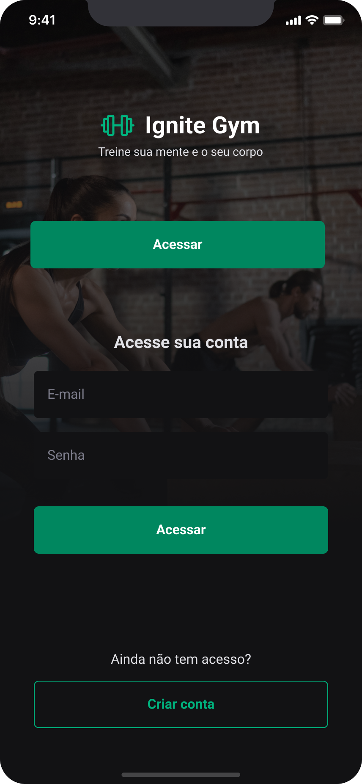
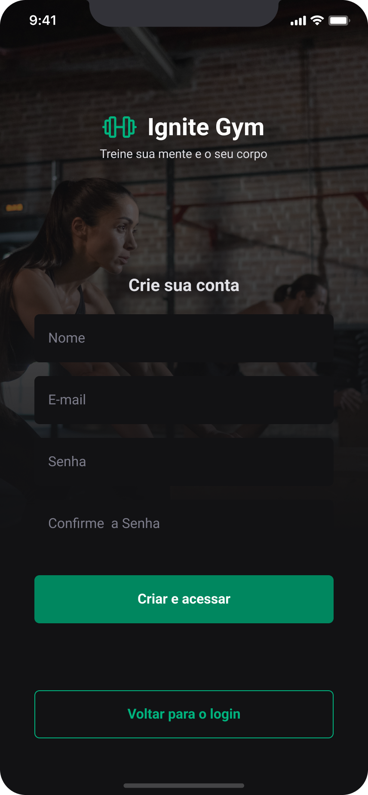
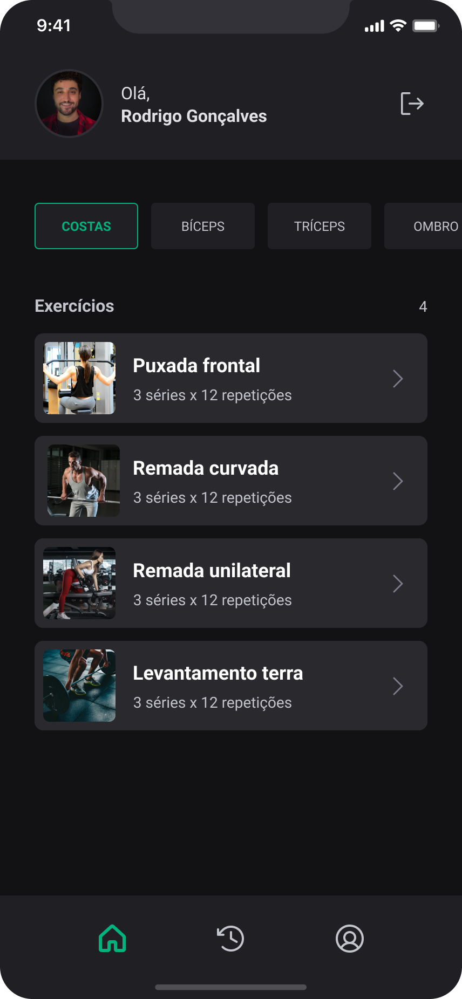
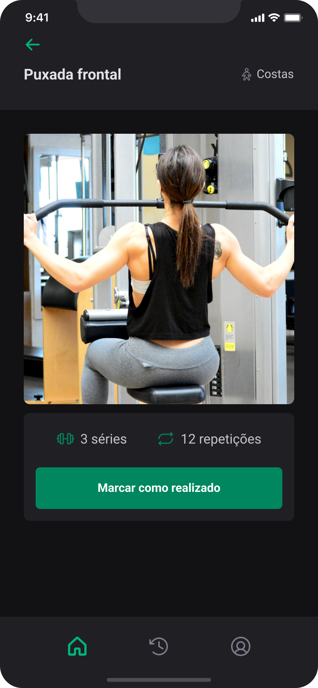
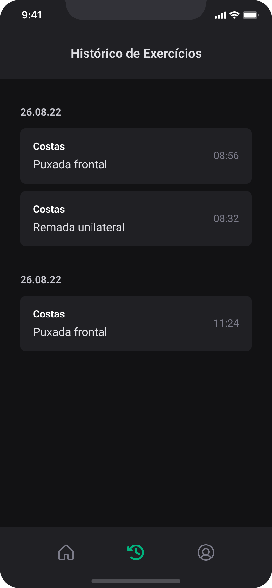
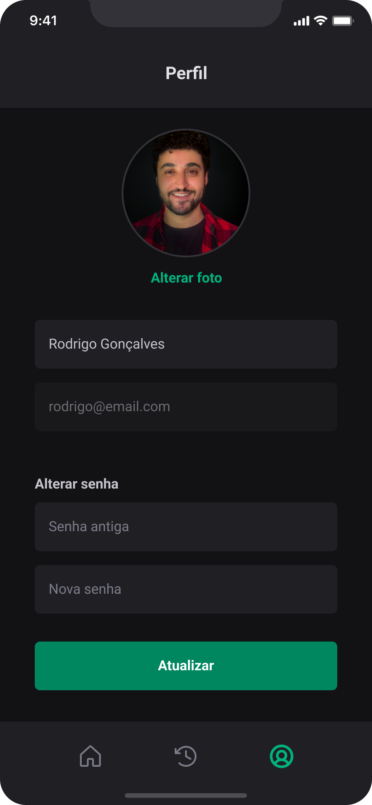

# Gym Flow

Aplicativo mobile em Expo/React Native para acompanhamento de treinos, com fluxo inicial de splash, login, cadastro e uma base preparada para integração com API.

## Preview

<p align="center">
  
  
  
</p>

<p align="center">
  
  
  
</p>

## Status

Base inicial criada com:

- Splash screen
- Login
- Cadastro
- Home mínima pós-autenticação
- Componentes reutilizáveis de UI
- Validação de formulários com `react-hook-form` e `zod`
- Serviços preparados para autenticação via API

## Tecnologias

- Expo SDK 54
- React 19
- React Native 0.81
- Expo Router
- TypeScript
- React Hook Form
- Zod
- Expo Vector Icons

## Estrutura

```txt
app/
  _layout.tsx
  index.tsx
  (auth)/
    _layout.tsx
    splash.tsx
    login.tsx
    sign-up.tsx
  (app)/
    _layout.tsx
    home.tsx

src/
  components/
    auth/
    ui/
  config/
  constants/
  services/
  types/

preview/
  login.png
  sign-up.png
  home.png
  exercise.png
  history.png
  profile.png
```

## Instalação

Instale as dependências:

```powershell
npm install
```

## Execução

Iniciar o Expo:

```powershell
npm run start
```

Rodar no navegador:

```powershell
npm run web
```

Rodar no Android:

```powershell
npm run android
```

Rodar no iOS:

```powershell
npm run ios
```

## Qualidade

Rodar o lint:

```powershell
npm run lint
```

Checar TypeScript:

```powershell
npx tsc --noEmit
```

## API

A base para integração com API está em:

- `src/config/env.ts`
- `src/services/api.ts`
- `src/services/auth.ts`
- `src/types/auth.ts`

Hoje o fluxo de autenticação usa mock em `src/services/auth.ts`. Quando a API real estiver pronta, a troca deve ficar concentrada nos serviços, sem espalhar `fetch` pelas telas.

Configure a URL base em `app.json`:

```json
{
  "expo": {
    "extra": {
      "apiUrl": "https://sua-api.com"
    }
  }
}
```

## Próximos passos

- Conectar login e cadastro na API real
- Persistir sessão do usuário
- Implementar home completa com treinos
- Criar histórico de exercícios
- Criar perfil do usuário
